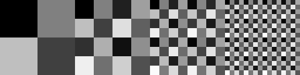
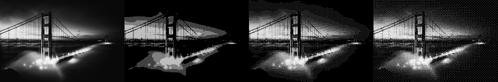

# Bayer Matrix Generator

## Descriptions
Generate level 1, 2, 3 and 4 Bayer matrix into a Pascal source file. A demo program and a texture generator are  also included.

* **BAYER**: Bayer matrix generator. Result is stored in a Pascal source file to include in your program.
* **DITHER**: An Ordered dithering program based on the generated matrix from BAYER. It take input as a PGM graymap, dithering it and write out a dithered bitmap in PBM format. These formats can be handled by using apps such as GIMP, Photoshop, XnView, etc. Samples graymaps are provided inside the TEST folder.
* **GENTEX**: Tool to generate Bayer matrices textures (128x128) in PGM graymaps.

## Changes

- Portable Bitmap support added, all outputs from DITHER are now stored in PBM.
- GENTEX utility added.
- Reorganized folder structures.

## Build

```
make
```
This repo is compatible with Turbo/Borland Pascal 7, TMT Pascal and Free Pascal. Feels free to use your beloved Pascal compiler. Please note that due to the limitation of Turbo Pascal, the maximum graymap size cannot exceed a segment (64K).

Tested in DOSBox only :)

## Samples

### Outputs of GENTEX



### Outputs from DITHER

Left to right: Original/Bayer2x2/Bayer4x4/Bayer8x8




