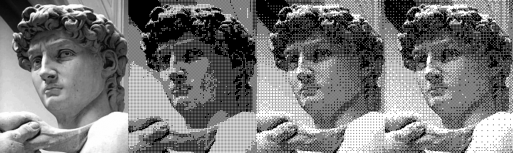

# Bayer Matrix Generator

## Purpose
Generate level 1, 2, 3 and 4 Bayer matrix into a Pascal include file. A demo program is also included.

## Build
```
make
```
This repo is compatible with Turbo Pascal, TMT Pascal and Free Pascal. Feels free to use your beloved Pascal compiler. Please note that due to the limitation of Turbo Pascal, the maximum image size cannot exceed a segment (64K).

## Samples

Left to right: Original/Bayer2x2/Bayer4x4/Bayer8x8



